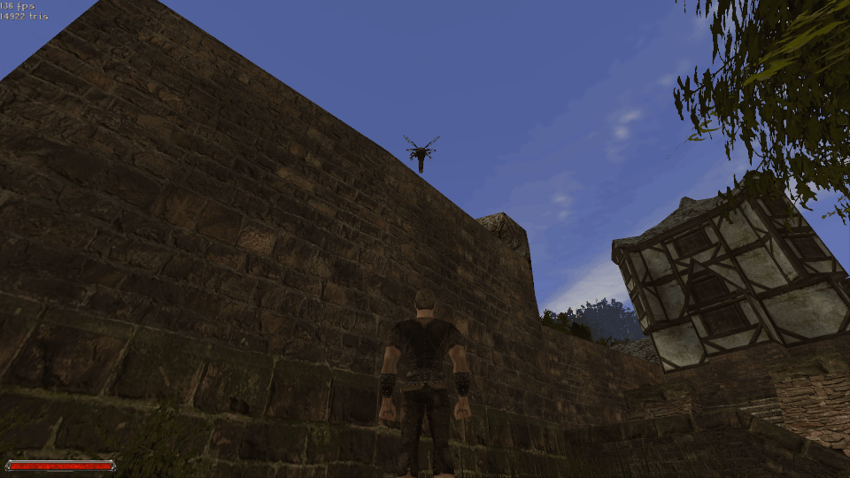

# FlyingCreaturesFix
This plugin is aimed at fixing a few issues with flying monsters:
1. Getting stuck on edges
2. Flying too high, so the player can't fight them properly

#### 1. Bloodfly stuck on edge of the wall

#### 2. Harpy flying too high
